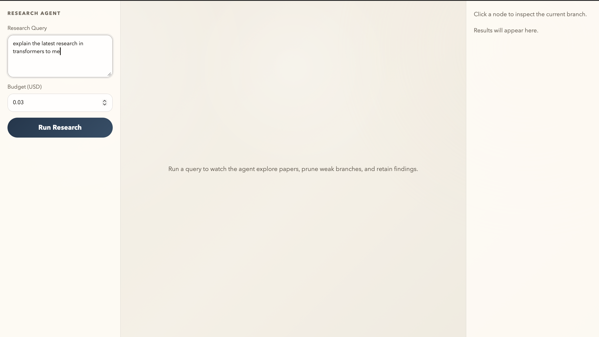
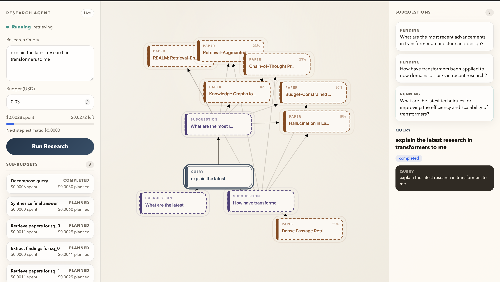
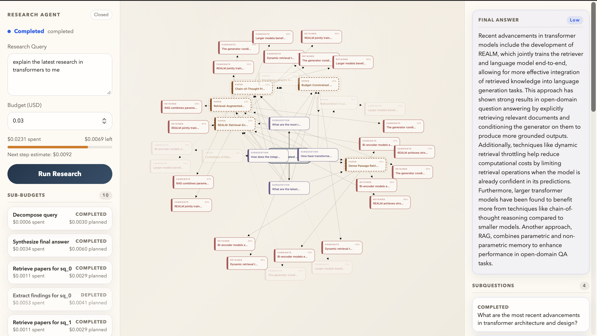

# Research Agent

## 1. Project overview and high level design

This project is a budget-constrained research agent that decomposes a user query into subquestions, retrieves papers locally, retains a small set of grounded findings, and synthesizes a final answer in a live graph-based UI.

At a high level:

- `frontend/` is a React dashboard that shows the graph, event log, budget, and retained findings in real time.
- `backend/` is a FastAPI service that creates sessions, stores session state, streams updates, and exposes webhook endpoints.
- `n8n/` contains the orchestration workflow that runs the staged research loop and reports progress back to the backend.

For the design rationale and evaluation criteria, see [evaluation.md](./evaluation.md). For the API contract between the frontend and backend, see [frontend_backend_contract.md](./frontend_backend_contract.md).

## 2. File structure and repo layout

```text
backend/
  app.py
  budget.py
  memory.py
  models.py
  pipeline.py
  retrieval.py
  streaming.py
  webhooks.py

frontend/
  src/App.tsx
  src/main.tsx
  src/styles.css
  tests/e2e/

n8n/
  research-agent.workflow.jsonc
  runtime/

img/
  step1.png
  step2.png
  step3.png
```

Additional implementation notes live in [n8n/README.md](./n8n/README.md) and [evaluation.md](./evaluation.md).

## 3. Demo of it working

The UI shows the run as it progresses from planning to retrieval to retained findings and final synthesis.







## 4. How to use

Install dependencies, start the backend and frontend, and optionally import the n8n workflow if you want the full orchestration path.

Create a `.env` file in the repo root with placeholders like:

```env
OPEN_AI_API_KEY=your_openai_api_key_here
N8N_WEBHOOK_URL=http://localhost:5678/webhook/research-session
FASTAPI_BASE_URL=http://localhost:8000

# Optional
RESEARCH_AGENT_TEST_MODE=false
```

Notes:

- `OPEN_AI_API_KEY` is required for live retrieval and synthesis.
- `N8N_WEBHOOK_URL` tells the backend where to trigger the workflow.
- `FASTAPI_BASE_URL` is used so n8n can post progress updates back to FastAPI.
- `RESEARCH_AGENT_TEST_MODE` is optional and is mainly useful for deterministic local testing.

Typical local flow:

1. Install Python requirements from `requirements.txt`.
2. Install frontend dependencies with `npm install` inside `frontend/`.
3. Start the backend with `uvicorn backend.app:app --reload`.
4. Start the frontend from `frontend/` with `npm run dev`.
5. Open the app in the browser, submit a query, and watch the live graph update.

If you are wiring up n8n, use [n8n/README.md](./n8n/README.md). If you want to understand the intended behavior and tradeoffs before changing the system, read [evaluation.md](./evaluation.md).
